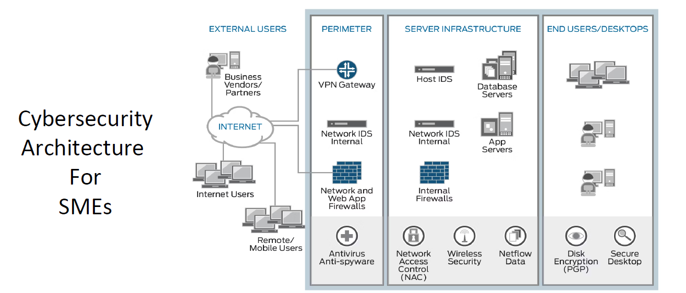
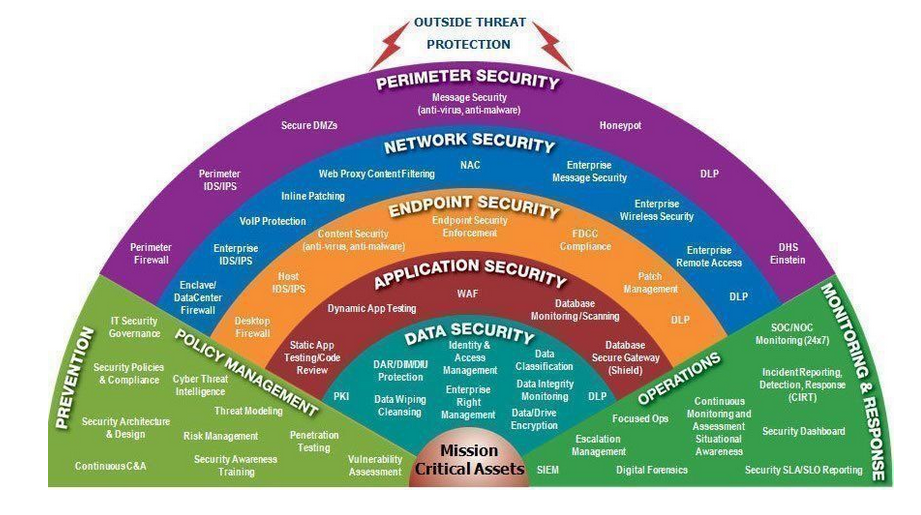

# Defense-in-Depth Enterprise Security Architecture

## Portfolio project by Poul Mhiripiri

This GitHub submission demonstrates how I would design, operate, and govern a **defense-in-depth security architecture** for **SMEs and larger enterprise environments** such as banks, ISPs, charities, and multi-branch organisations.

The project is written from the perspective of an **AVP / IT Networks and Infrastructure Support Manager** with hands-on experience across enterprise networking, perimeter security, internal segmentation, identity, endpoint protection, vulnerability management, monitoring, backup, and incident response.

> **Purpose:** Give recruiters and hiring managers evidence that I can translate infrastructure and security experience into a structured, risk-based architecture and operational model.

---

## Business requirement and threat context

This project was necessitated by the continued rise of **cybersecurity breaches affecting major enterprises, Fortune 500 companies, supplier ecosystems, and federal/public-sector organisations**. Recent attack patterns have shown that organisations are exposed not only to direct compromise, but also to:

- Supply chain attacks through trusted vendors, managed service providers, and software dependencies
- Ransomware and destructive malware campaigns
- Phishing and credential theft
- Misconfiguration in cloud and SaaS environments
- Lateral movement after an initial foothold
- Data theft from flat or weakly segmented networks

The business requirement behind this repository is therefore to design a security architecture that helps organisations:

1. Reduce the chance of a successful breach
2. Contain attacker movement if one control fails
3. Protect critical business systems and sensitive data
4. Improve detection, response, and recovery readiness
5. Support secure business growth for SMEs as well as more regulated environments

This repository shows how layered security controls can be combined to reduce single points of failure and improve resilience.

---

## What this project demonstrates

- Enterprise and SME security architecture thinking, not just isolated technical tasks
- Defense-in-depth across network, endpoint, identity, data, cloud, monitoring, and recovery layers
- Practical controls that map to recognised frameworks such as **NIST CSF 2.0** and **CIS Controls v8**
- Experience delivering infrastructure and security projects in regulated and high-availability environments
- Ability to document executive rationale, technical design, operational controls, risk, and incident response
- Ability to relate hands-on delivery experience from **banking, ISP/core networking, and cybersecurity labs/projects** into a recruiter-friendly portfolio

---

## Scenario

A growing organisation has multiple branches, remote users, cloud workloads, Microsoft 365 services, third-party integrations, and sensitive customer data. The organisation requires a layered security model to reduce the likelihood and impact of compromise.

This project proposes a target architecture where no single security control is relied upon alone. Every layer assumes that another layer may fail.

---

## Cybersecurity architecture for SMEs

The diagram below illustrates a practical SME-oriented security architecture with layered controls spanning external access, perimeter security, server infrastructure, and end-user environments.



### Why this matters for SMEs

SMEs are often targeted because they may have fewer dedicated security resources, yet still process sensitive business, financial, employee, and customer data. A layered architecture helps SMEs adopt proportionate controls without needing to operate like a very large enterprise.

Example SME security capabilities represented in this architecture include:

- VPN gateway for secure remote access
- Network IDS and host IDS for monitoring
- Firewalls at perimeter and internal boundaries
- Antivirus / anti-spyware controls
- Network Access Control (NAC)
- Wireless security
- NetFlow/traffic visibility
- Disk encryption and secure desktop practices

---

## Defense-in-depth infographic

The infographic below visually reinforces the layered control philosophy used in this repository. It highlights how **prevention**, **policy management**, **operations**, and **monitoring & response** work together around key security domains such as perimeter, network, endpoint, application, and data security.



### Practical relevance to my experience

The controls reflected in the infographic are not purely theoretical. Through my hands-on projects and career experience, I have covered many of these domains, including:

- Perimeter firewall operations and segmentation
- VPN and secure third-party connectivity
- Data centre and enterprise network support
- Endpoint protection and patching
- Vulnerability management and audit remediation
- Central logging, SIEM use cases, and alert monitoring
- Backup, resilience, and recovery planning
- ISP/core networking experience involving BGP, MPLS, peering, and availability improvement

This means the repository does not present defense-in-depth as a concept only; it shows how the author has applied many of the layers in real operational environments.

---

## Architecture layers

| Layer | Control focus | Example technologies / capabilities |
|---|---|---|
| Governance | Policies, risk ownership, audit tracking, change control | Risk register, security committee reporting, exception management |
| Perimeter | Internet edge protection | Next-generation firewall, IPS, geo/IP filtering, VPN, DMZ |
| Network | Internal segmentation and secure routing | VLANs, VRFs, ACLs, firewall zones, secure routing, HA design |
| Identity | Least privilege and access control | MFA, RBAC, conditional access, privileged access review |
| Endpoint | Malware and hardening controls | EDR/AV, patching, device control, secure build baselines |
| Email/Web | User-facing threat prevention | Email security gateway, anti-phishing, web filtering, sandboxing |
| Vulnerability | Exposure management | Authenticated scanning, patch prioritisation, remediation tracking |
| Monitoring | Detection and response | SIEM, central logging, correlation rules, alert triage |
| Data | Confidentiality and integrity | Encryption, hashing/tokenisation, backup encryption, DLP principles |
| Recovery | Resilience after compromise | Immutable/offline backup, restore testing, DR exercises |

---

## Repository structure

```text
defense-in-depth-enterprise-security-architecture/
├── README.md
├── docs/
│   ├── 00-business-requirements-and-threat-context.md
│   ├── 01-executive-summary.md
│   ├── 02-high-level-architecture.md
│   ├── 02a-sme-cybersecurity-architecture.md
│   ├── 03-defense-in-depth-layers.md
│   ├── 04-project-evidence-and-achievements.md
│   ├── 05-control-mapping-nist-csf-cis.md
│   ├── 06-incident-response-playbook.md
│   ├── 07-risk-register.md
│   ├── 08-implementation-roadmap.md
│   └── 09-professional-summary-and-interview-notes.md
├── diagrams/
│   └── defense-in-depth-architecture.mmd
├── assets/
│   └── images/
│       ├── cybersecurity-architecture-for-smes.png
│       └── defense-in-depth-infographic.png
├── configs/
│   ├── firewall-policy-sample.csv
│   ├── network-hardening-baseline.md
│   ├── siem-detection-use-cases.md
│   └── backup-and-recovery-runbook.md
└── .github/workflows/
    └── markdown-quality-check.yml
```

---

## Key achievements represented in this project

The examples below are anonymised and written as portfolio evidence rather than confidential employer documentation.

- Supported secure infrastructure for a multi-branch financial services environment with high availability expectations
- Worked with enterprise firewall platforms including Check Point, Cisco ASA/Firepower/FTD, and FortiGate
- Supported internal segmentation, VPN connectivity, DMZ design, and secure third-party integrations
- Participated in vulnerability management, audit issue closure, endpoint protection, SIEM/logging, and security hardening
- Delivered ISP/core networking projects involving BGP, MPLS, upstream providers, peering, CDN optimisation, and availability improvements
- Built cloud/security labs using AWS, Wazuh, Qualys/Nessus concepts, endpoint controls, and GitHub documentation

---

## How to use this repository in interviews

A recruiter or hiring manager can review this project to understand:

1. How I structure security architecture from governance to recovery
2. How I think about practical risk reduction, not only tool deployment
3. How my infrastructure background supports cybersecurity engineering and network security roles
4. How I relate banking, ISP, and hands-on cyber project experience to a layered security model
5. How I would communicate security posture to technical and non-technical stakeholders

Recommended interview explanation:

> “This repository shows how I approach enterprise defense-in-depth. It combines my network and infrastructure management background with cybersecurity controls such as segmentation, endpoint protection, vulnerability management, SIEM detection, identity controls, and recovery planning. I created it to show how I can take real operational experience and express it as a structured security architecture recruiters can review. I also linked the design to the threat reality organisations face today, including supply chain attacks and large-scale breaches.”

---

## Framework references

- NIST Cybersecurity Framework 2.0: Govern, Identify, Protect, Detect, Respond, Recover
- CIS Critical Security Controls v8: prioritised safeguards and Implementation Groups

---

## Disclaimer

This repository is a portfolio project. It does not contain confidential employer information, production firewall rules, real IP addresses, customer data, secrets, or proprietary diagrams.
