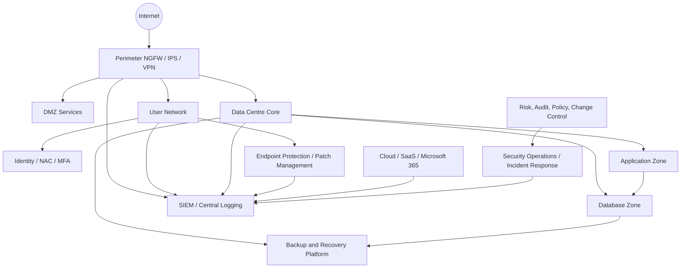

# High-Level Architecture

## Design principles

1. **Assume breach** — design as though credentials, endpoints, or one network segment may already be compromised.
2. **Least privilege** — users, systems, and administrators receive only the access required.
3. **Segmentation** — critical systems are separated from user networks and third-party connections.
4. **Visibility** — logs must be collected, normalised, retained, and reviewed.
5. **Resilience** — backup and recovery must be designed before an incident occurs.
6. **Governance** — risk decisions must be documented, approved, and tracked.

## Logical architecture

## Key design choices

- Internet-facing services are placed in a DMZ and protected by firewall policy, IPS, logging, and change control.
- Critical database and application systems are separated from normal user VLANs.
- Remote access uses VPN and MFA rather than direct exposure of management interfaces.
- Administrative access is controlled, logged, and reviewed.
- SIEM receives logs from firewalls, servers, endpoints, cloud services, and identity systems.
- Backups are protected from ransomware through separation, encryption, and restore testing.
